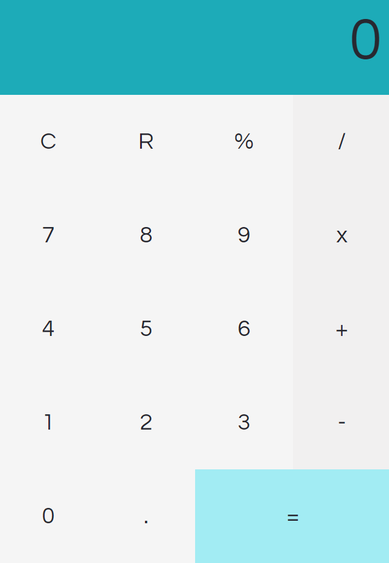

# Calculadora
Um sistema simples de calculo, desenvolvido apenas para treino pessoal. Projeto criado em 2019.

Deploy do projeto: https://viniciuslimaan.github.io/calculadora

Para utilizar o programa use: 

```
git clone https://github.com/viniciuslimaan/calculadora.git
```

## Tecnologias utilizadas
* Html
* CSS
* Bootstrap
* JavaScript (jQuery)

## Imagem do projeto

